# Intelligent GIS-Based Proactive Relocation Decision Support System

[](https://www.sih.gov.in/)
[](https://www.sih.gov.in/)
[](#domain--scope)
[](#implementation-status)
[](#license)

---

## Core Philosophy

> **"Don't wait for a disaster to happen. Identify high-risk habitations in advance, determine safer relocation locations, and help authorities prioritize relocation decisions using GIS, multi-hazard analysis, AI, and data-driven decision support."**

---

## Table of Contents

- [1. Executive Summary & Problem Context](#1-executive-summary--problem-context)
  - [1.1 Limitations of Traditional Reactive Disaster Management](#11-limitations-of-traditional-reactive-disaster-management)
  - [1.2 The Imperative for Proactive Relocation](#12-the-imperative-for-proactive-relocation)
  - [1.3 Core Questions Answered by the Platform](#13-core-questions-answered-by-the-platform)
- [2. End-to-End Solution Workflow](#2-end-to-end-solution-workflow)
  - [2.1 Conceptual Processing Pipeline](#21-conceptual-processing-pipeline)
  - [2.2 Stage-by-Stage Processing Architecture](#22-stage-by-stage-processing-architecture)
- [3. Data Sources & Spatial Layer Specifications](#3-data-sources--spatial-layer-specifications)
- [4. GIS & Spatial Feature Engineering](#4-gis--spatial-feature-engineering)
- [5. AI & Machine Learning Architecture](#5-ai--machine-learning-architecture)
  - [5.1 Supervised ML vs. Multi-Criteria Decision Analysis (AHP)](#51-supervised-ml-vs-multi-criteria-decision-analysis-ahp)
  - [5.2 Prediction Pipeline & Feature Attribution](#52-prediction-pipeline--feature-attribution)
- [6. Multi-Hazard Risk Engine](#6-multi-hazard-risk-engine)
  - [6.1 Mathematical Formulation](#61-mathematical-formulation)
  - [6.2 Risk Classification Tiers](#62-risk-classification-tiers)
- [7. Red Zone Identification & Spatial Buffering](#7-red-zone-identification--spatial-buffering)
- [8. Vulnerability Assessment Formulation](#8-vulnerability-assessment-formulation)
  - [8.1 Distinguishing Hazard, Exposure, Vulnerability, and Risk](#81-distinguishing-hazard-exposure-vulnerability-and-risk)
  - [8.2 Multi-Dimensional Vulnerability Indicators](#82-multi-dimensional-vulnerability-indicators)
- [9. Candidate Relocation Site Detection & Suitability Analysis](#9-candidate-relocation-site-detection--suitability-analysis)
  - [9.1 Spatial Exclusion Criteria (Constraint Filtering)](#91-spatial-exclusion-criteria-constraint-filtering)
  - [9.2 Multi-Factor Suitability Scoring](#92-multi-factor-suitability-scoring)
- [10. Carrying Capacity Assessment Engine](#10-carrying-capacity-assessment-engine)
  - [10.1 Mathematical Capacity Model](#101-mathematical-capacity-model)
  - [10.2 Preventing Secondary Disasters](#102-preventing-secondary-disasters)
- [11. Relocation Prioritization Matrix](#11-relocation-prioritization-matrix)
- [12. GIS Architecture & Spatial Data Infrastructure](#12-gis-architecture--spatial-data-infrastructure)
- [13. System Architecture Diagram](#13-system-architecture-diagram)
- [14. Technology Stack](#14-technology-stack)
- [15. Target Repository & Directory Structure](#15-target-repository--directory-structure)
  - [15.1 Complete Project Directory Tree](#151-complete-project-directory-tree)
  - [15.2 Module Responsibilities & Component Mapping](#152-module-responsibilities--component-mapping)
  - [15.3 Folder Structure Maintenance Rules for Development](#153-folder-structure-maintenance-rules-for-development)
- [16. Installation & Environment Setup](#16-installation--environment-setup)
- [17. Running the Platform](#17-running-the-platform)
- [18. API Specification Blueprint (Target OpenAPI)](#18-api-specification-blueprint-target-openapi)
- [19. Government Decision-Support Dashboard](#19-government-decision-support-dashboard)
- [20. Explainable AI (XAI) & Administrative Interpretability](#20-explainable-ai-xai--administrative-interpretability)
- [21. Innovation & Paradigm Shift](#21-innovation--paradigm-shift)
- [22. SIH Jury Demo Workflow](#22-sih-jury-demo-workflow)
- [23. One-Minute Pitch for Judges](#23-one-minute-pitch-for-judges)
- [24. System Limitations & Assumptions](#24-system-limitations--assumptions)
- [25. Security, Privacy & Governance](#25-security-privacy--governance)
- [26. Verification & Quality Assurance Strategy](#26-verification--quality-assurance-strategy)
- [27. Performance & Scalability Engineering](#27-performance--scalability-engineering)
- [28. UI/UX & Dashboard Visual Placeholders](#28-uiux--dashboard-visual-placeholders)
- [29. Future Roadmap & Scaling Scope](#29-future-roadmap--scaling-scope)
- [30. Implementation Status Matrix](#30-implementation-status-matrix)
- [31. Contributing Guidelines](#31-contributing-guidelines)
- [32. License](#32-license)

---

## 1. Executive Summary & Problem Context

Disaster management in India has historically operated under an emergency response paradigm: mobilize rescue units after an event occurs, distribute emergency relief, set up makeshift shelters, and carry out post-facto reconstruction. In ecologically fragile and geomorphologically vulnerable zones—such as the Western Ghats, the Himalayan arc, and cyclone-prone coastal belts—communities face repeated devastation from landslides, flash floods, coastal erosion, and cloudbursts.

### 1.1 Limitations of Traditional Reactive Disaster Management

1. **Repetitive Catastrophe Cycles:** When habitations damaged by previous events are rebuilt on the same hazardous terrain, they remain vulnerable to the next monsoon or seismic event.
2. **Exorbitant Economic & Human Cost:** Emergency rescue operations (airlifting, NDRF/SDRF deployment, temporary camps) incur recurring expenditures that far exceed the cost of proactive, planned relocation.
3. **Siloed Hazard Mapping:** Conventional hazard maps typically analyze one threat in isolation (e.g., only flood or only landslide). Real-world crises involve cascading hazards—an extreme rainfall anomaly triggers flash floods in river valleys while inducing slope failure along mountain corridors, cutting off evacuation roads simultaneously.
4. **Lack of Relocation Direction:** Standard GIS disaster maps stop at drawing red hazard polygons. They fail to answer the most urgent administrative question: *Where can displaced populations be safely relocated without overwhelming recipient infrastructure or exposing them to new hazards?*

### 1.2 The Imperative for Proactive Relocation

Proactive relocation involves identifying high-risk habitations **before disaster strikes**, evaluating candidate recipient locations for safety and carrying capacity, and generating phased, actionable prioritization lists for State and District Disaster Management Authorities (SDMA / DDMA).

```text
CONVENTIONAL PARADIGM (Reactive):
Disaster Occurs ──► Destruction ──► Emergency Evacuation ──► Temporary Relief Camps ──► Rebuild in Same Hazard Zone

OUR PLATFORM PARADIGM (Proactive):
Multi-Source Data ──► AI/GIS Risk Prediction ──► Red Zone Detection ──► Candidate Site Suitability ──► Carrying Capacity ──► Phased Relocation
```

### 1.3 Core Questions Answered by the Platform

The system provides concrete, quantitative answers to four fundamental governance questions:

| # | Administrative Question | System Resolution Mechanism |
|---|-------------------------|-----------------------------|
| **Q1** | **Which geographic areas are strictly unsafe for permanent human habitation?** | Multi-hazard spatial overlay combining flood inundation, landslide susceptibility, extreme precipitation, and slope stability into dynamic **Red Zones**. |
| **Q2** | **Which specific habitations are currently facing critical danger?** | Spatial intersection of geolocated revenue villages/habitations with Red Zones, factoring in population exposure and vulnerability indices. |
| **Q3** | **Where can affected populations be safely and sustainably relocated?** | Multi-criteria spatial suitability engine filtering for low-hazard zones, gentle slopes, road access, and adequate carrying capacity (land, water, healthcare, schooling). |
| **Q4** | **Which habitations must be relocated first, and on what timeline?** | Multi-attribute decision matrix prioritizing habitations into **Immediate (Priority 1)**, **Short-Term (Priority 2)**, **Medium-Term (Priority 3)**, and **In-Situ Monitoring**. |

---

## 2. End-to-End Solution Workflow

### 2.1 Conceptual Processing Pipeline

```mermaid
flowchart TD
    subgraph S1["Data Ingestion & Extraction"]
        A1["Copernicus DEM (30m)"]
        A2["NASA GPM IMERG Precipitation"]
        A3["WorldPop High-Res Grids"]
        A4["ESA WorldCover (10m)"]
        A5["ISRO Bhuvan / Data.gov.in / NDMA"]
        A6["OpenStreetMap (OSM) Vectors"]
        A7["SoilGrids ISRIC (250m)"]
    end

    subgraph S2["Preprocessing & GIS Feature Engineering"]
        B1["CRS Harmonization (EPSG:4326 / UTM)"]
        B2["Terrain Analytics: Slope, Aspect, TWI, Curvature"]
        B3["Rainfall Cumulative & Anomaly Computation"]
        B4["Spatial Buffering & Network Distance Extraction"]
        B5["Zonal Statistics & Raster-Vector Intersections"]
    end

    subgraph S3["AI & Multi-Hazard Risk Modeling"]
        C1["Supervised ML / XGBoost Hazard Model"]
        C2["Multi-Criteria AHP Risk Engine"]
        C3["Composite Risk Score: Hazard x Exposure x Vulnerability"]
        C4["Dynamic Red Zone Boundary Generation"]
    end

    subgraph S4["Habitation Vulnerability & Site Suitability Engine"]
        D1["Vulnerable Habitation Spatial Join"]
        D2["Habitation Vulnerability Index (HVI) Scoring"]
        D3["Exclusion Masking (Hazard Buffers, Slopes > 25 deg)"]
        D4["Candidate Site Identification"]
        D5["Multi-Criteria Suitability Scoring (Proximity to Roads, Water, Hospitals)"]
    end

    subgraph S5["Carrying Capacity & Prioritization"]
        E1["Per-Capita Land & Resource Thresholds"]
        E2["Recipient Site Infrastructure Capacity Check"]
        E3["Multi-Objective Relocation Prioritization"]
        E4["Phased Action Classification (Immediate / Short / Medium)"]
    end

    subgraph S6["Decision Support & Interactive GIS"]
        F1["Government Interactive Map Dashboard"]
        F2["XAI Factor Attribution Cards (Why is it Red?)"]
        F3["Administrative Relocation Action Plan Exporter"]
    end

    S1 --> S2
    S2 --> S3
    S3 --> S4
    S4 --> S5
    S5 --> S6
```



### 2.2 Stage-by-Stage Processing Architecture

1. **Multi-Source Data Ingestion:** Earth observation rasters, meteorological feeds, population grids, and infrastructure vector data are fetched from authoritative open and national repositories.
2. **Spatial Harmonization & Feature Engineering:** Rasters are reprojected, resampled to uniform spatial bounds, and processed for hydrologic and topographic derivatives (slope, Topographic Wetness Index, cumulative precipitation, road network proximity).
3. **AI/ML Multi-Hazard Risk Modeling:** Models ingest spatial feature vectors to estimate hazard susceptibility probabilities and generate composite multi-hazard risk indices.
4. **Red Zone & Habitation Identification:** Risk continuous values are segmented into classification tiers. Habitation centroids and polygons intersecting extreme risk zones are tagged for relocation analysis.
5. **Candidate Relocation Site Detection:** The engine applies spatial exclusion filters (eliminating floodplains, steep slopes, protected forests, and hazard buffers) and detects viable contiguous safe land parcels.
6. **Site Suitability & Carrying Capacity Evaluation:** Candidate parcels are scored based on accessibility to lifelines (roads, water, hospitals, power, schools) and checked against population absorption limits.
7. **Relocation Priority Ranking:** Vulnerable settlements are algorithmically ranked using multi-attribute utility theory, giving disaster managers an actionable priority queue.
8. **Government Decision-Support Dashboard:** An interactive WebGIS interface visualizes hazard overlays, habitation status cards, candidate relocation sites, and explainability breakdowns.

---

## 3. Data Sources & Spatial Layer Specifications

The table below outlines all target open and government data feeds integrated into the system design:

| Dataset Name | Source / Provider | Spatial Resolution | Temporal Resolution / Update | Key Variables / Derived Layers | Role in Platform | Integration Status |
|---|---|---|---|---|---|---|
| **Copernicus DEM (GLO-30)** | European Space Agency (ESA) | 30 meters | Static (Annual update) | Elevation, slope, aspect, curvature, Topographic Wetness Index (TWI) | Topographic modeling, landslide susceptibility, drainage modeling | 🔴 Planned Pipeline |
| **NASA GPM IMERG** | NASA / JAXA | 0.1° (~10 km) | 30-min to Daily | Precipitation rate, 1-day, 3-day, 7-day, 30-day cumulative rainfall, anomaly | Extreme rainfall hazard mapping, trigger thresholding | 🔴 Planned Pipeline |
| **WorldPop** | WorldPop / Univ. of Southampton | 100 meters | Annual estimates | Gridded population count, age-sex demographic breakdown | Population exposure calculation, vulnerable demographic weighting | 🔴 Planned Pipeline |
| **ESA WorldCover** | ESA / Sentinel-1 & 2 | 10 meters | Annual | Land cover classes: Built-up, Tree cover, Cropland, Water, Bare soil | Land-use classification, candidate site filtering, runoff estimation | 🔴 Planned Pipeline |
| **ISRO Bhuvan Disaster Layers** | NRSC / ISRO | Variable (Vector/Raster) | Periodic / Event-based | Flood inundation history, landslide hazard zonation, wasteland atlas | Ground truth hazard verification, wasteland identification for relocation | 🔴 Planned Pipeline |
| **Open Government Data (OGD)** | data.gov.in / Census of India | District / Village | Decennial / Census | Village population, literacy, household infrastructure, kutcha housing % | Socio-economic vulnerability indices, demographic baseline | 🔴 Planned Pipeline |
| **OpenStreetMap (OSM)** | OpenStreetMap Contributors | Vector (Points/Lines) | Continuous / Dynamic | Primary/secondary roads, hospitals, primary health centers, schools, power | Accessibility analysis, network distance, infrastructure availability | 🔴 Planned Pipeline |
| **SoilGrids** | ISRIC - World Soil Information | 250 meters | Static | Soil texture, depth to bedrock, clay fraction, drainage capacity | Geotechnical viability, slope failure mechanics, foundation suitability | 🔴 Planned Pipeline |
| **Historical Disaster Inventories** | NDMA, SDMA, GSI, CWC, EM-DAT | Vector Points / Polygons | Historical records | Past landslide scars, historic high-flood levels (HFL), damage records | Ground truth label generation for supervised ML model training | 🔴 Planned Pipeline |

---

## 4. GIS & Spatial Feature Engineering

Raw geospatial rasters and vector shapefiles cannot be fed directly into decision engines. The system derives specialized spatial features to capture geophysical and socio-demographic realities:

```text
+-------------------+      +-------------------------------------------------------------+
|   Raw Geospatial  | ===> |            GIS-Derived Feature Engineering                  |
|      Inputs       |      +-------------------------------------------------------------+
+-------------------+      | • Slope (°), Aspect, TWI, Relative Elevation to Drainage    |
                           | • 1-Day, 3-Day, 7-Day Cumulative Rain & Anomaly (%)         |
                           | • Network Distance to Nearest All-Weather Road & Hospital   |
                           | • Built-Up Fraction & Impervious Surface Ratio              |
                           | • Historical Hazard Recurrence Density (per km²)            |
                           +-------------------------------------------------------------+
```

### 4.1 DEM-Derived Terrain Features
- **Slope Gradient ($S$):** Calculated via finite difference algorithms ($3\times 3$ moving window) representing terrain steepness in degrees. Critical for landslide slip modeling and flood accumulation.
- **Topographic Wetness Index ($\text{TWI}$):** Defined as $\text{TWI} = \ln(a / \tan \beta)$, where $a$ is specific catchment area and $\beta$ is slope angle. Indicates zones prone to soil water saturation and flash flooding.
- **Aspect & Curvature:** Planform and profile curvature quantify flow convergence/divergence and deceleration/acceleration across slopes.
- **Height Above Nearest Drainage (HAND):** Normalizes digital elevation relative to the local drainage network, directly highlighting flood inundation zones.

### 4.2 Precipitation-Derived Hydrological Features
- **Short-Term Cumulative Precipitation ($R_{1d}, R_{3d}$):** Quantifies sudden extreme cloudburst bursts capable of triggering debris flows and flash floods.
- **Antecedent Soil Moisture Proxy ($R_{7d}, R_{30d}$):** Measures prolonged soil saturation that weakens slope shear strength.
- **Rainfall Anomaly Index:** Percentage deviation of current precipitation relative to historical multi-year normal for the matching calendar window.

### 4.3 Demographics & Exposure Features
- **Gridded Population Density:** Derived from WorldPop raster aggregations per square kilometer.
- **Demographic Vulnerability Ratio:** Percentage of dependent population (children $< 5$ years and elderly $> 65$ years).
- **Structural Housing Vulnerability:** Proportion of kutcha (non-engineered mud/thatch) dwellings versus pucca structures from Census records.

### 4.4 Accessibility & Lifeline Infrastructure Features
- **Euclidean & Network Distance to All-Weather Roads:** Measures isolation and evacuation difficulty.
- **Distance to Primary Healthcare Facilities (PHC/District Hospital):** Determines emergency medical access.
- **Distance to Potable Water Sources & Power Grid:** Key criterion for candidate relocation site evaluation.

---

## 5. AI & Machine Learning Architecture

### 5.1 Supervised ML vs. Multi-Criteria Decision Analysis (AHP)

The architecture distinguishes between empirical Machine Learning models and Rule-Based Multi-Criteria Decision Analysis (AHP/MCDA):

```text
RAW GEOSPATIAL DATA
        │
        ▼
SPATIAL FEATURE VECTOR
        │
   ┌────┴────────────────────────────────┐
   ▼                                     ▼
[SUPERVISED MACHINE LEARNING]         [MULTI-CRITERIA AHP BASELINE]
• Model: Random Forest / XGBoost      • Analytical Hierarchy Process
• Ground Truth: Historical Scars      • Expert-Derived Weight Matrix
• Output: Hazard Probability (0.0-1.0) • Output: Synthetic Vulnerability Index
   └────┬────────────────────────────────┘
        │
        ▼
COMPOSITE MULTI-HAZARD RISK SCORE
        │
        ▼
TIERED RISK CLASSIFICATION (Low / Moderate / High / Very High)
```

- **When Supervised ML is Used:** To predict empirical hazard susceptibility (e.g., landslide probability or flood inundation probability) where historical ground-truth inventories (past landslide scars recorded by Geological Survey of India or flood extents mapped by NRSC/ISRO) exist.
- **When MCDA/AHP is Used:** To establish defensible multi-hazard weights, vulnerability indexing, and site suitability rankings where regulatory criteria (e.g., maximum allowable slope for settlement, minimum buffer from riverbanks) require strict administrative transparency.

### 5.2 Prediction Pipeline & Feature Attribution

1. **Input Representation:** Each spatial grid cell $c_i$ is represented by a feature vector $\mathbf{x}_i = [Elevation, Slope, TWI, Rain_{3d}, Dist_{Road}, Soil_{Type}, LULC]$.
2. **Model Training:** Binary classifiers (Random Forest / Gradient Boosted Trees) trained with spatial $k$-fold cross-validation to prevent spatial autocorrelation leakage.
3. **Probability Calibration:** Platt scaling or isotonic regression calibrates model logits into true posterior hazard probabilities $P(\text{Hazard} \mid \mathbf{x}_i) \in [0, 1]$.
4. **Explainability Layer:** TreeSHAP calculates feature contribution vectors $\phi_j(\mathbf{x}_i)$, enabling the dashboard to display exact factors driving an area's high risk.

---

## 6. Multi-Hazard Risk Engine

### 6.1 Mathematical Formulation

Disaster risk is formulated in strict accordance with the internationally recognized United Nations Office for Disaster Risk Reduction (UNDRR) framework:

$$\text{Risk} = f(\text{Hazard}, \text{Exposure}, \text{Vulnerability})$$

Within the platform, the composite risk score for a habitation or grid cell $i$ is calculated as:

$$\mathcal{R}_i = \left( \sum_{h \in \mathcal{H}} w_h \cdot \mathcal{S}_{h, i} \right) \times \left( \mathcal{E}_i \right)^{\alpha} \times \left( \mathcal{V}_i \right)^{\beta}$$

Where:
- $\mathcal{H} = \{\text{Flood}, \text{Landslide}, \text{Extreme Precipitation}, \text{Coastal Erosion}\}$ is the set of considered hazards.
- $\mathcal{S}_{h, i} \in [0, 1]$ represents the normalized hazard susceptibility or probability for hazard $h$ at cell $i$.
- $w_h \in [0, 1]$ is the weight assigned to hazard $h$ ($\sum w_h = 1$), configured based on regional climatological dominance.
- $\mathcal{E}_i$ is the normalized exposure index (population density, asset concentration, infrastructure count).
- $\mathcal{V}_i$ is the multi-dimensional vulnerability index (socio-economic fragility, lack of coping capacity, physical isolation).
- $\alpha, \beta \in [0.5, 1.0]$ are sensitivity scaling exponents preventing zero-collapse while preserving non-linear risk escalation.

### 6.2 Risk Classification Tiers

Continuous composite risk scores ($\mathcal{R}_i \in [0, 100]$) are mapped into four administrative action tiers:

| Tier | Risk Score Range | Color Code | Administrative Implication |
|---|---|---|---|
| **Low** | $0.0 \le \mathcal{R}_i < 30.0$ | 🟢 Green | Normal vigilance; suitable for continued habitation and long-term development. |
| **Moderate** | $30.0 \le \mathcal{R}_i < 55.0$ | 🟡 Yellow | Moderate risk; requires structural mitigation, drainage improvements, and local awareness. |
| **High** | $55.0 \le \mathcal{R}_i < 75.0$ | 🟠 Orange | Severe hazard potential; prioritized for planned, medium-to-short-term relocation. |
| **Very High (Red Zone)** | $75.0 \le \mathcal{R}_i \le 100.0$ | 🔴 Red | Unacceptable danger to life; designated as **Red Zone** requiring immediate proactive relocation. |

---

## 7. Red Zone Identification & Spatial Buffering

A **Red Zone** in this platform denotes a geographically delineated spatial polygon where the multi-hazard composite risk exceeds safety thresholds, making the territory fundamentally unsuitable for permanent human dwelling.

```text
+---------------------------------------------------------------------------------+
|                               RED ZONE GENERATION                               |
|                                                                                 |
|   1. Raster Thresholding: Extract cells where Risk Score >= 75.0                |
|   2. Morphological Closing: Fill micro-holes and merge contiguous pixels        |
|   3. Vectorization: Polygonize raster clusters into GeoJSON geometries         |
|   4. Safety Buffering: Expand boundaries by dynamic safety margin (100m - 500m) |
|   5. Habitation Intersection: Detect settlements located inside buffer polygons |
+---------------------------------------------------------------------------------+
```

- **Spatial Buffering:** In high-relief terrain, hazard zones cannot be delineated with rigid pixel-edges. A safety buffer (typically $100\,\text{m}$ to $500\,\text{m}$, scaled by local slope gradient) is applied around active hazard polygons to account for rockfall trajectory and flood runout margins.
- **Habitation Detection:** Settlement centroids and village administrative boundaries are spatially intersected with the buffered Red Zones. Habitations where $> 25\%$ of built-up area or $> 100$ residents fall within a Red Zone are flagged for relocation candidate processing.

---

## 8. Vulnerability Assessment Formulation

### 8.1 Distinguishing Hazard, Exposure, Vulnerability, and Risk

A clear, technically rigorous separation of disaster components is maintained:

```text
┌──────────────┐     ┌──────────────┐     ┌──────────────────┐     ┌────────────────────────┐
│    HAZARD    │     │   EXPOSURE   │     │  VULNERABILITY   │     │          RISK          │
├──────────────┤     ├──────────────┤     ├──────────────────┤     ├────────────────────────┤
│ The physical │  X  │ People,      │  X  │ Susceptibility   │  =  │ Expected human loss,   │
│ phenomenon   │     │ homes, and   │     │ to suffer injury │     │ destruction, and       │
│ (cloudburst, │     │ assets in    │     │ or damage when   │     │ economic ruin over     │
│ landslide)   │     │ harm's way   │     │ exposed          │     │ a given time horizon   │
└──────────────┘     └──────────────┘     └──────────────────┘     └────────────────────────┘
```

- **Hazard ($H$):** The probability and magnitude of a potentially damaging physical event occurring within a specific spatial window.
- **Exposure ($E$):** The presence of people, dwellings, economic assets, or infrastructure in hazard-prone areas. If no people or assets are present, Risk is zero regardless of hazard intensity.
- **Vulnerability ($V$):** The pre-existing physical, structural, social, and economic conditions that determine the susceptibility of an exposed community to the damaging effects of a hazard.
- **Risk ($R$):** The anticipated probability of adverse consequences resulting from interactions between natural hazards and vulnerable conditions.

### 8.2 Multi-Dimensional Vulnerability Indicators

Habitation vulnerability is calculated across three key dimensions:

1. **Physical & Structural Vulnerability ($V_{phys}$):**
   - Percentage of kutcha/mud-walled housing units.
   - Building density and lack of engineered structural reinforcements.
   - Proximity to unstable cut-slopes or unengineered drainage canals.
2. **Socio-Demographic Vulnerability ($V_{soc}$):**
   - High dependency ratio (proportion of infants, pregnant women, elderly, persons with disabilities).
   - Socio-economic poverty indices and lack of private transportation assets.
3. **Infrastructural & Isolation Vulnerability ($V_{infra}$):**
   - Single-access road connectivity (cul-de-sac habitations that get cut off by a single bridge failure or landslide).
   - Network travel time to emergency trauma care $> 60$ minutes.
   - Absence of localized early-warning sirens or cellular redundancy.

---

## 9. Candidate Relocation Site Detection & Suitability Analysis

Relocating an endangered community requires identifying sites that are definitively safe, environmentally sustainable, and socially viable.

### 9.1 Spatial Exclusion Criteria (Constraint Filtering)

Candidate lands must pass strict binary spatial filters (Boolean AND masking):

$$\text{Candidate Area} = \neg (\text{Red Zone Buffer}) \cap \neg (\text{Slope} > 15^\circ) \cap \neg (\text{Forest Reserve}) \cap \neg (\text{Flood Buffer}) \cap (\text{Contiguous Area} \ge A_{\min})$$

1. **Hazard Exclusion:** Zero overlap with any 100-year flood zone, active landslide polygon, or coastal erosion buffer.
2. **Terrain Slope Threshold:** Slopes $> 15^\circ$ (27%) are excluded to avoid creating new slope failure hazards and prohibitive construction costs.
3. **Ecological & Legal Protection:** National parks, reserved forests, wildlife corridors, and wetland bodies are masked out.
4. **Minimum Contiguous Acreage:** Minimum contiguous land parcel size $A_{\min}$ required to house the candidate community with basic civic amenities.

### 9.2 Multi-Factor Suitability Scoring

Viable parcels passing the exclusion mask are scored using a Multi-Factor Spatial Suitability Index ($\text{SSI} \in [0, 100]$):

$$\text{SSI}_k = \sum_{j=1}^{M} w_j \cdot f_j(d_j)$$

Where $f_j(d_j)$ is a normalized distance decay or utility function for factor $j$:

| Suitability Factor | Target Metric / Threshold | Weight ($w_j$) | Ideal Range |
|---|---|---|---|
| **Road Network Proximity** | Distance to primary/secondary all-weather road | 0.25 | $200\,\text{m} - 1,500\,\text{m}$ |
| **Water Resource Availability** | Distance to perennial freshwater source / aquifer | 0.20 | $500\,\text{m} - 3,000\,\text{m}$ |
| **Healthcare Accessibility** | Network travel time to nearest PHC / Hospital | 0.20 | $< 30$ minutes ($< 10\,\text{km}$) |
| **Education Infrastructure** | Distance to primary / secondary school | 0.15 | $< 3\,\text{km}$ |
| **Proximity to Original Village** | Preserves livelihoods, agricultural ties, and culture | 0.10 | $3\,\text{km} - 15\,\text{km}$ |
| **Topographic Flatness** | Gentle terrain gradient ($2^\circ - 8^\circ$) for drainage | 0.10 | $< 8^\circ$ |

---

## 10. Carrying Capacity Assessment Engine

> **Carrying Capacity Definition:** Carrying capacity evaluates whether a candidate recipient site can realistically accommodate the relocated population without causing ecological degradation, depleting groundwater reserves, overloading healthcare/educational infrastructure, or causing secondary vulnerability.

```text
+---------------------------------------------------------------------------------+
|                           CARRYING CAPACITY AUDIT                               |
|                                                                                 |
|   Candidate Site B: Available Usable Land = 120,000 m²                          |
|   Target Habitation: Population = 2,500 residents (500 households)             |
|                                                                                 |
|   1. Spatial Density Capacity: 120,000 m² / (45 m²/person) = 2,666 persons  [OK]|
|   2. Daily Potable Water Need: 2,500 × 135 L = 337.5 kL/day                 [OK]|
|   3. Primary Healthcare Bed Ratio: 2,500 / 1,000 × 1.5 beds = 3.75 beds     [OK]|
|   4. Schooling Seat Availability: Recipient cluster capacity audited       [OK]|
|                                                                                 |
|   STATUS: CAPABLE (Capacity Factor = 1.07 > 1.0) ──► APPROVED                   |
+---------------------------------------------------------------------------------+
```

### 10.1 Mathematical Capacity Model

The overall carrying capacity factor $\mathcal{C}_k$ for candidate site $k$ relative to relocated population $P_{reloc}$ is defined as:

$$\mathcal{C}_k = \min \left( \frac{\text{Land Area}_k}{P_{reloc} \cdot \theta_{\text{land}}}, \frac{\text{Water Capacity}_k}{P_{reloc} \cdot \theta_{\text{water}}}, \frac{\text{Health Capacity}_k}{P_{reloc} \cdot \theta_{\text{health}}}, \frac{\text{School Capacity}_k}{P_{reloc} \cdot \theta_{\text{school}}} \right)$$

Where:
- $\theta_{\text{land}}$: Minimum spatial footprint per capita (national standard: $40-60\,\text{m}^2$ inclusive of residential plot, roads, sanitation, and green buffers).
- $\theta_{\text{water}}$: Standard potable water supply per capita per day (CPHEEO standard: 135 liters per capita per day).
- $\theta_{\text{health}}$: Standard hospital bed ratio (1.5 - 2 beds per 1,000 residents).
- $\theta_{\text{school}}$: Primary educational seating ratio per 100 school-aged children.

### 10.2 Preventing Secondary Disasters
If $\mathcal{C}_k < 1.0$, relocating the entire habitation to site $k$ will induce a **secondary disaster** (severe water scarcity, informal slum creation, deforestation of surrounding slopes). In such cases, the system either:
1. Rejects the candidate site.
2. Triggers an **algorithmic split-relocation plan** (allocating sub-clusters across multiple nearby recipient sites).
3. Issues an **infrastructure deficit alert** listing exact capital expenditures (e.g., pipeline extension, additional school classrooms) required before relocation can commence.

---

## 11. Relocation Prioritization Matrix

Authorities cannot relocate 100 vulnerable villages simultaneously due to budgetary, administrative, and logistical constraints. The platform computes a **Relocation Priority Index (RPI)** to generate a transparent, ranked intervention list.

### 11.1 Prioritization Index Formulation

$$\text{RPI}_i = 0.35 \cdot \mathcal{R}_i + 0.25 \cdot \mathcal{E}_i^{pop} + 0.20 \cdot \mathcal{V}_i^{infra} + 0.10 \cdot \mathcal{H}_i^{hist} + 0.10 \cdot \mathcal{F}_i^{avail}$$

Where:
- $\mathcal{R}_i$: Multi-hazard risk score.
- $\mathcal{E}_i^{pop}$: Exposed population volume.
- $\mathcal{V}_i^{infra}$: Infrastructural isolation / cutoff vulnerability.
- $\mathcal{H}_i^{hist}$: Historical disaster frequency and casualty record.
- $\mathcal{F}_i^{avail}$: Feasibility factor (presence of an approved candidate site with $\mathcal{C}_k \ge 1.0$).

### 11.2 Phased Action Tiers

```text
┌─────────────────────────────────────────────────────────────────────────────────┐
│                          RELOCATION ACTION QUEUE                                │
├──────────────┬──────────────────┬─────────────────┬─────────────────────────────┤
│ Priority Tier│ Time Horizon     │ Action Level    │ Administrative Directive    │
├──────────────┼──────────────────┼─────────────────┼─────────────────────────────┤
│ Priority 1   │ 0 - 6 Months     │ Immediate       │ Urgent gazetted order; land │
│ (Critical)   │                  │ Relocation Plan │ acquisition; pre-monsoon evacuation│
├──────────────┼──────────────────┼─────────────────┼─────────────────────────────┤
│ Priority 2   │ 6 - 18 Months    │ Short-Term      │ Infrastructure preparation  │
│ (High)       │                  │ Planned Move    │ at recipient site; budget allocation│
├──────────────┼──────────────────┼─────────────────┼─────────────────────────────┤
│ Priority 3   │ 18 - 36 Months   │ Medium-Term     │ Phased community engagement;│
│ (Moderate)   │                  │ Phased Scheme   │ voluntary relocation packages│
├──────────────┼──────────────────┼─────────────────┼─────────────────────────────┤
│ Priority 4   │ Continuous       │ In-Situ         │ Early-warning sensors; slope│
│ (Monitoring) │                  │ Mitigation      │ drainage; structural retrofitting│
└──────────────┴──────────────────┴─────────────────┴─────────────────────────────┘
```

---

## 12. GIS Architecture & Spatial Data Infrastructure

```text
Spatial Ingestion ──► GDAL / Rasterio / GeoPandas ──► PostGIS Spatial DB ──► Vector Tiles (GeoJSON/MVT) ──► Leaflet / MapLibre UI
```

1. **Coordinate Reference System (CRS) Policy:**
   - **Storage & Ingestion:** `EPSG:4326` (WGS 84 geographic coordinates) for global datasets and interchange.
   - **Spatial Analytics & Computations:** Projected Coordinate Systems (local `UTM WGS 84` zones, e.g., `EPSG:32643` for Western India / `EPSG:32644` for Central-Eastern India) to guarantee accurate metric distances, slope angle computations, and polygon area evaluations without latitudinal distortion.
   - **Web Rendering:** `EPSG:3857` (Web Mercator) for vector tiles and interactive browser maps.
2. **Raster Processing Engine:** Python `Rasterio` and `GDAL` pipelines with Cloud-Optimized GeoTIFF (COG) generation, windowed reads, and chunked processing to prevent RAM exhaustion when handling state-wide 30m DEM rasters.
3. **Vector Processing Engine:** `GeoPandas`, `Shapely`, and `PyProj` for spatial intersections, convex hulls, buffering, and Voronoi tessellations.
4. **Spatial Indexing:** R-Tree spatial indexing (`rtree`, PostGIS `GIST` indices) ensuring sub-second spatial joins across thousands of habitation points and complex multi-hazard boundary polygons.

---

## 13. System Architecture Diagram

```mermaid
flowchart TD
    subgraph ClientLayer["Frontend Presentation Layer (React / Vite + Leaflet / MapLibre)"]
        UI1["Interactive WebGIS Map & Layer Switcher"]
        UI2["Red Zone & Vulnerable Habitation Inspector"]
        UI3["Candidate Relocation Site Explorer"]
        UI4["Carrying Capacity Gauge & Infrastructure Audit"]
        UI5["Relocation Action Plan Exporter (PDF / CSV)"]
    end

    subgraph APILayer["Backend Application Server (FastAPI / Python)"]
        API1["/api/v1/hazard/layers (Raster/Vector feeds)"]
        API2["/api/v1/habitations/vulnerable (Filtered Habitations)"]
        API3["/api/v1/relocation/candidate-sites (Suitability analysis)"]
        API4["/api/v1/prioritization/ranked-queue (Multi-attribute scoring)"]
        API5["/api/v1/xai/feature-importance (SHAP factor attribution)"]
    end

    subgraph ServiceEngines["Core Processing & Analytics Engines"]
        ENG1["Multi-Hazard Risk Engine"]
        ENG2["Spatial Exclusion & Candidate Detector"]
        ENG3["Site Suitability Engine (MCDA / AHP)"]
        ENG4["Carrying Capacity Modeling Engine"]
        ENG5["Prioritization Ranking Service"]
    end

    subgraph MLEngine["AI / ML Modeling Pipeline"]
        ML1["Spatial Feature Extraction Pipeline"]
        ML2["Supervised Hazard Classifier (XGBoost / Random Forest)"]
        ML3["Model Explainability Service (TreeSHAP)"]
    end

    subgraph StorageLayer["Persistence & Geospatial Data Infrastructure"]
        DB1[("PostgreSQL + PostGIS (Spatial Database)")]
        DB2[("Raster Store / Cloud-Optimized GeoTIFFs")]
        DB3[("Static Demographics & Census Metadata")]
    end

    ClientLayer <==>|REST / GeoJSON / Vector Tiles| APILayer
    APILayer <--> ServiceEngines
    ServiceEngines <--> MLEngine
    ServiceEngines <--> StorageLayer
    MLEngine <--> StorageLayer
```



---

## 14. Technology Stack

| Architecture Layer | Target Technology | Rationale & Purpose | Current Status |
|---|---|---|---|
| **Frontend Framework** | **React.js / Vite** | Fast, component-driven dashboard UI for high-frequency interactive GIS state management. | 🔴 Planned / Target |
| **Styling & Design System** | **Vanilla CSS3 / Modern Glassmorphism** | Curated dark-mode design system with crisp contrast for high-stress command rooms; no bulky CSS frameworks. | 🔴 Planned / Target |
| **Web Mapping Engine** | **Leaflet / MapLibre GL JS** | High-performance client-side rendering of raster tiles, GeoJSON overlays, and interactive markers. | 🔴 Planned / Target |
| **Backend API Framework** | **FastAPI (Python 3.10+)** | High-throughput asynchronous REST API with automatic OpenAPI (Swagger) documentation. | 🔴 Planned / Target |
| **GIS Raster Processing** | **GDAL / Rasterio** | Industry-standard spatial raster manipulation, re-projection, and windowed band extraction. | 🔴 Planned / Target |
| **GIS Vector Processing** | **GeoPandas / Shapely / PyProj** | Coordinate transformations, spatial buffering, polygon unions, and point-in-polygon joins. | 🔴 Planned / Target |
| **Machine Learning** | **Scikit-Learn / XGBoost** | Gradient boosted decision trees for tabular/spatial hazard susceptibility prediction. | 🔴 Planned / Target |
| **Model Explainability** | **SHAP (SHapley Additive exPlanations)** | Decomposes model risk predictions into transparent factor contributions for administrators. | 🔴 Planned / Target |
| **Database** | **PostgreSQL + PostGIS** | Spatial database storing village geometries, infrastructure vectors, and spatial indexing (GIST). | 🔴 Planned / Target |
| **Environment & Package Mgmt** | **Python `venv` / `pip` & Node `npm`** | Standardized dependency management with strict version locking. | 🟡 Configured / Environment Verified |

---

## 15. Target Repository & Directory Structure

To ensure enterprise-grade modularity, clean separation of concerns, and rigorous architectural discipline during code writing, the project adheres to the standardized folder structure detailed below. **All development must strictly respect and maintain this directory layout.**

### 15.1 Complete Project Directory Tree

```text
SIH/
├── .env.example                        # Standardized template for environment variables and paths
├── .gitignore                          # Excludes venv, node_modules, cache, and heavy data files
├── LICENSE                             # Open-source licensing agreement (TBD by team)
├── README.md                           # Master architectural and technical documentation
├── package.json                        # Frontend root package manifest and dev scripts
├── pyproject.toml                      # Modern Python project configuration, linter, and build metadata
├── requirements.txt                    # Python backend, geospatial, and ML dependencies
├── vite.config.js                      # Vite bundler configuration with proxy rules for API
│
├── backend/                            # FastAPI Asynchronous Application Server
│   ├── app/
│   │   ├── __init__.py                 # Package initializer
│   │   ├── main.py                     # App factory, CORS middleware, exception handlers, router mounts
│   │   ├── core/                       # Fundamental application configurations
│   │   │   ├── __init__.py
│   │   │   ├── config.py               # Pydantic BaseSettings: CRS definitions, paths, thresholds
│   │   │   ├── logging.py              # Centralized structured log formatting (Rich / logging)
│   │   │   └── security.py             # API authentication, CORS policies, role-based checks
│   │   ├── api/                        # HTTP Presentation Layer (REST Endpoints)
│   │   │   ├── __init__.py
│   │   │   └── v1/
│   │   │       ├── __init__.py
│   │   │       ├── router.py           # Master v1 router aggregating all feature sub-routers
│   │   │       ├── habitations.py      # Habitation queries, filtering, demographic exposure endpoints
│   │   │       ├── hazards.py          # Hazard rasters, terrain metrics, active hazard boundary endpoints
│   │   │       ├── relocation.py       # Candidate site detection, spatial buffering, suitability queries
│   │   │       ├── prioritization.py   # Ranked priority queue endpoints (Immediate, Short, Medium)
│   │   │       ├── xai.py              # TreeSHAP feature attribution & What-If scenario endpoints
│   │   │       └── reports.py          # Official administrative relocation dossier export endpoints
│   │   ├── models/                     # Data Schemas & Domain Entities
│   │   │   ├── __init__.py
│   │   │   ├── schemas.py              # Pydantic request/response validation schemas
│   │   │   ├── spatial_models.py       # GeoJSON Feature and FeatureCollection wrappers
│   │   │   └── domain.py               # Core domain dataclasses (Habitation, CandidateSite, RiskResult)
│   │   ├── services/                   # Pure Business Logic & Scientific Calculators
│   │   │   ├── __init__.py
│   │   │   ├── risk_engine.py          # Multi-hazard composite risk calculation (H × E × V)
│   │   │   ├── suitability_engine.py   # Multi-criteria spatial suitability scoring (MCDA / AHP)
│   │   │   ├── capacity_engine.py      # Carrying capacity evaluation (land, water, health, school)
│   │   │   ├── prioritization_engine.py# Multi-attribute priority queue ranking algorithm
│   │   │   ├── xai_service.py          # SHAP explanation calculations and factor attribution
│   │   │   └── report_service.py       # PDF and CSV administrative report generator
│   │   ├── db/                         # Persistence Layer (Optional / PostGIS integration)
│   │   │   ├── __init__.py
│   │   │   ├── session.py              # Database engine, connection pooling, session generator
│   │   │   └── base.py                 # Declarative ORM base and spatial table definitions
│   │   └── utils/                      # Helper Utilities
│   │       ├── __init__.py
│   │       ├── geo_utils.py            # Bounding-box calculators, centroid finders, CRS conversions
│   │       └── formatters.py           # Output data serializers, number rounding, date formatters
│   └── tests/                          # Backend Test Suite
│       ├── __init__.py
│       ├── conftest.py                 # Pytest fixtures, mock test clients, spatial sample data
│       ├── test_api_habitations.py     # Endpoint tests for habitation retrieval
│       ├── test_api_relocation.py      # Endpoint tests for candidate site discovery
│       ├── test_risk_engine.py         # Unit tests for multi-hazard composite risk math
│       ├── test_suitability_engine.py  # Unit tests for spatial suitability scoring
│       └── test_capacity_engine.py     # Unit tests for carrying capacity factor calculations
│
├── frontend/                           # React / Vite Interactive WebGIS Application
│   ├── index.html                      # HTML5 single-page application entry point
│   ├── package.json                    # Frontend package dependencies (Leaflet, Lucide, Axios)
│   ├── vite.config.js                  # Frontend Vite server and proxy configuration
│   ├── public/                         # Static Web Assets
│   │   ├── favicon.ico                 # App browser icon
│   │   ├── logo.svg                    # Official platform emblem
│   │   └── markers/                    # Custom SVG map pin icons (Red Zone, Safe Site, Hospital)
│   └── src/                            # Source Code
│       ├── main.jsx                    # React application DOM bootstrap
│       ├── App.jsx                     # Master application shell and layout orchestrator
│       ├── components/                 # Reusable UI Components
│       │   ├── Navbar.jsx              # Top header with state emblem, district selector, alert banner
│       │   ├── MapViewer.jsx           # Core WebGIS interactive map canvas (Leaflet / MapLibre)
│       │   ├── LayerControl.jsx        # Hazard layer toggles (DEM slope, rainfall, Red Zones, habitations)
│       │   ├── HabitationDetail.jsx    # Selected village card (risk score, demographics, dominant hazards)
│       │   ├── RelocationSiteCard.jsx  # Candidate site metrics (slope, distance, suitability score)
│       │   ├── CapacityGauge.jsx       # Visual carrying capacity dials (land, water, healthcare, school)
│       │   ├── PriorityQueue.jsx       # Prioritized administrative action list with urgency badges
│       │   ├── XAIExplanationModal.jsx # SHAP factor attribution breakdown ("Why is this Red?")
│       │   └── ReportExporter.jsx      # Modal to export official government relocation action dossiers
│       ├── hooks/                      # Custom React State & Data Hooks
│       │   ├── useMapState.js          # Synchronizes map center, zoom, bounds, and active layers
│       │   ├── useHabitations.js       # Fetches and filters vulnerable habitation data
│       │   ├── useRelocationSites.js   # Fetches candidate relocation sites and capacity factors
│       │   └── usePrioritization.js    # Manages ranked priority queue state
│       ├── services/                   # Client-Side Networking & API Communication
│       │   ├── api.js                  # Centralized Axios HTTP client with interceptors
│       │   └── geoJsonService.js       # GeoJSON parser, layer style resolvers, marker builders
│       ├── styles/                     # CSS Design System
│       │   ├── index.css               # Global CSS variables, modern typography (Outfit/Inter), resets
│       │   ├── dashboard.css           # Glassmorphic layout, command center panels, sidebar styling
│       │   └── map.css                 # Leaflet container overrides, custom marker tooltips, popups
│       └── utils/                      # Client-Side Helper Functions
│           ├── colorScales.js          # Risk tier color maps (Green: Low, Red: Critical Red Zone)
│           ├── geoHelpers.js           # Coordinates formatting, bounding box calculation
│           └── formatters.js           # Number formatting, metric unit converters (m² to hectares, etc.)
│
├── ml/                                 # Machine Learning Modeling Subsystem
│   ├── data/                           # ML Datasets (Git-ignored if large)
│   │   ├── ground_truth/               # Historical disaster inventories (GSI landslides, NRSC floods)
│   │   └── features/                   # Pre-computed tabular feature matrices (.parquet / .csv)
│   ├── preprocessing/                  # Data Preparation & Feature Extraction
│   │   ├── __init__.py
│   │   ├── extract_features.py         # Extracts terrain, rainfall, and land-cover features per grid cell
│   │   └── spatial_cv_split.py         # Spatial block cross-validation splitter (avoids spatial leakage)
│   ├── training/                       # Model Training & Evaluation
│   │   ├── __init__.py
│   │   ├── train_hazard_model.py       # XGBoost / Random Forest classifier training pipeline
│   │   ├── evaluate_model.py           # Computes AUC-ROC, Brier score, Precision-Recall curves
│   │   └── hyperparameter_tune.py      # Optuna / GridSearch hyperparameter optimization
│   ├── inference/                      # Real-Time & Batch Inference
│   │   ├── __init__.py
│   │   ├── predict_risk.py             # Inference pipeline taking raster windows -> hazard probabilities
│   │   └── explain_model.py            # Generates TreeSHAP feature attribution values for predictions
│   └── saved_models/                   # Serialized Model Artifacts
│       ├── .gitkeep
│       ├── hazard_xgboost_v1.json      # Trained XGBoost model parameters
│       └── feature_scaler.joblib       # Fitted scikit-learn standardizer / normalizer
│
├── gis/                                # Geospatial Processing Subsystem
│   ├── raster/                         # Raster Analytics (GDAL / Rasterio)
│   │   ├── __init__.py
│   │   ├── terrain_analysis.py         # Calculates Slope (°), Aspect, TWI, and HAND from Copernicus DEM
│   │   ├── rainfall_processor.py       # Aggregates 1d, 3d, 7d, 30d cumulative rain & anomalies from GPM
│   │   └── raster_resampler.py         # Harmonizes spatial resolution, clipping, and bounds matching
│   ├── vector/                         # Vector Geoprocessing (GeoPandas / Shapely)
│   │   ├── __init__.py
│   │   ├── buffer_generator.py         # Generates dynamic slope-scaled safety buffers around hazard zones
│   │   ├── network_analysis.py         # Computes Euclidean and network distances to roads and hospitals
│   │   ├── zonal_stats.py              # Aggregates raster metrics (mean slope, rain) over village polygons
│   │   └── polygonizer.py              # Converts contiguous high-risk raster clusters into GeoJSON Red Zones
│   ├── pipelines/                      # Ingestion & Orchestration Workflows
│   │   ├── __init__.py
│   │   ├── ingest_raw_data.py          # Automated downloader/extractor for open earth observation datasets
│   │   └── harmonize_crs.py            # Converts all incoming spatial layers to uniform CRS (EPSG:4326/UTM)
│   └── config/                         # Spatial Definitions
│       ├── __init__.py
│       └── spatial_constants.py        # CRS constants, pixel resolutions, search radii, slope cutoffs
│
├── data/                               # Local Data Directory (Tracked via .gitkeep; large files ignored)
│   ├── raw/                            # Untouched source rasters and shapefiles
│   │   └── .gitkeep
│   ├── processed/                      # Harmonized, clipped, and analysis-ready GeoTIFFs
│   │   └── .gitkeep
│   ├── samples/                        # Lightweight sample GeoJSONs for development and demo testing
│   │   ├── sample_habitations.geojson  # 20+ realistic vulnerable habitations with demographic attributes
│   │   ├── sample_red_zones.geojson    # Delineated high-risk Red Zone polygons with safety buffers
│   │   └── sample_candidate_sites.geojson # Candidate safe relocation parcels with suitability metrics
│   └── exports/                        # Temporary output directory for generated PDF action dossiers
│       └── .gitkeep
│
├── scripts/                            # Operational & Developer Utility Scripts
│   ├── seed_database.py                # Populates local PostGIS database with sample habitations and layers
│   ├── download_sample_data.py         # Fetches demo Copernicus DEM tiles and GPM precipitation clips
│   ├── verify_environment.py           # Validates Python, Node, GDAL, and GEOS versions and bindings
│   └── run_full_pipeline.py            # End-to-end execution script: Ingest -> Preprocess -> Model -> Output
│
└── docs/                               # Documentation, Blueprints & Presentation Assets
    ├── architecture/                   # In-depth architectural designs
    │   ├── system_design.md            # Component interactions and sequence diagrams
    │   └── data_flow.md                # Data transformation specifications across layers
    ├── datasets/                       # Data attribution and schemas
    │   ├── data_dictionary.md          # Variable names, types, units, and source citations
    │   └── attribution.md              # Compliance notices for Copernicus, NASA, ISRO, and OSM
    └── screenshots/                    # UI mockups, architectural diagrams, and presentation slides
        └── .gitkeep
```

---

### 15.2 Module Responsibilities & Component Mapping

| Subsystem / Directory | Primary Responsibility | Input Artifacts | Output Artifacts | Primary Dependencies |
|---|---|---|---|---|
| **`backend/app/api/v1/`** | REST HTTP routing, request deserialization, response formatting, status codes. | HTTP Requests (JSON/Query) | OpenAPI JSON / GeoJSON responses | `FastAPI`, `Pydantic` |
| **`backend/app/services/`** | Mathematical risk modeling, carrying capacity evaluation, prioritization algorithms. | Domain dataclasses & spatial vectors | Calculated scores, ranked queues, audit logs | `NumPy`, `SciPy`, `Pydantic` |
| **`frontend/src/components/`** | Interactive UI rendering, WebGIS map controls, inspection cards, capacity dials. | Component props, custom hook state | Interactive DOM, Leaflet map overlays | `React`, `Leaflet`, `Lucide Icons` |
| **`gis/raster/`** | Topographic and meteorological raster processing, terrain derivatives. | Raw GeoTIFFs (DEM, GPM) | Analysis rasters (Slope, TWI, Cumulative Rain) | `GDAL`, `Rasterio`, `NumPy` |
| **`gis/vector/`** | Spatial buffering, vector polygonization, spatial joins, distance metrics. | Vector GeoJSONs / Shapefiles | Red Zone polygons, network proximity matrices | `GeoPandas`, `Shapely`, `PyProj` |
| **`ml/training/`** | Supervised model fitting, spatial cross-validation, hyperparameter tuning. | Extracted feature parquet + ground truth | Serialized model files (`.json`, `.joblib`) | `XGBoost`, `Scikit-Learn` |
| **`ml/inference/`** | Susceptibility prediction on feature vectors and TreeSHAP explainability computation. | Cell feature vectors | Hazard probability $[0, 1]$ + SHAP values | `XGBoost`, `SHAP` |
| **`data/samples/`** | Provides self-contained mock geospatial datasets for offline testing and jury demos. | Static JSON / GeoJSON | Instant dashboard population without live GIS | Standard GeoJSON |

---

### 15.3 Folder Structure Maintenance Rules for Development

To guarantee that the codebase remains clean, maintainable, and aligned with enterprise software engineering standards during implementation, all developers and AI agents must follow these rules:

1. **Zero Loose Files in Root:** Never create standalone Python scripts, scratch files, or test outputs directly in the repository root (`SIH/`). All code must reside strictly within its designated folder (`backend/`, `frontend/`, `gis/`, `ml/`, `scripts/`, or `tests/`).
2. **Strict Layer Isolation (Separation of Concerns):**
   - **Frontend:** Must contain zero scientific risk formulas or GIS raster code; it communicates with the backend exclusively via typed REST APIs (`frontend/src/services/api.js`).
   - **Backend API Routes:** Route handlers (`backend/app/api/v1/*.py`) must only validate inputs and call services. Heavy business calculations belong exclusively in `backend/app/services/`.
   - **GIS Subsystem:** Geoprocessing pipelines (`gis/`) are modular standalone modules that can be run as CLI jobs or called by backend services.
3. **Single Source of Truth for Configuration:**
   - All spatial thresholds (e.g., `MAX_HABITATION_SLOPE = 15.0`), CRS definitions (`EPSG:4326`, `EPSG:32643`), file directory paths, and database credentials must be defined in `backend/app/core/config.py` using `pydantic-settings`. Hardcoding absolute paths or thresholds inside service functions is strictly forbidden.
4. **Coordinate Reference System (CRS) Discipline:**
   - All GIS functions taking spatial geometries must explicitly declare and verify the CRS.
   - Storage CRS is always `EPSG:4326`.
   - Metric distance, slope, buffer, and area calculations must project to the appropriate `UTM` zone (`EPSG:32643` or local zone) before computation.
   - Web rendering GeoJSONs must be output in `EPSG:4326` (which Leaflet/MapLibre projects to `EPSG:3857`).
5. **Standardized Naming & Import Conventions:**
   - Python files and functions: `snake_case` (e.g., `terrain_analysis.py`, `calculate_twi()`).
   - React components: `PascalCase` (e.g., `MapViewer.jsx`, `CapacityGauge.jsx`).
   - JavaScript utilities: `camelCase` (e.g., `geoHelpers.js`, `formatNumber()`).
   - Python imports must use absolute package paths from the project root (e.g., `from backend.app.core.config import settings` or `from gis.raster.terrain_analysis import calculate_slope`).
6. **Data & Secret Protection:**
   - Heavy binary data files (`.tif`, `.img`, `.shp`) must remain in `data/raw/` or `data/processed/`, which are excluded from version control via `.gitignore`.
   - Only lightweight demo samples are permitted in `data/samples/`.
   - Never commit API keys, database passwords, or personal directory paths; all secrets must be read from environment variables via `.env`.

---

## 16. Installation & Environment Setup

### 16.1 Prerequisites
- **Operating System:** Windows 10/11, Linux (Ubuntu 20.04+), or macOS
- **Python:** Python 3.10 to 3.14 (Python 3.14.3 verified in local development environment)
- **Node.js:** Node.js v18.0+ and npm v9.0+ (Node v24.14.1 & npm 11.11.0 verified)
- **Git:** Git 2.40+ installed and added to system PATH

### 16.2 Repository Clone & Initial Setup
```bash
# Clone the repository
git clone https://github.com/your-username/SIH26191-Intelligent-Relocation-DSS.git
cd SIH26191-Intelligent-Relocation-DSS
```

### 16.3 Backend Environment Setup (Python)
```bash
# Create a virtual environment
python -m venv venv

# Activate virtual environment
# Windows (PowerShell):
.\venv\Scripts\Activate.ps1
# Windows (CMD):
.\venv\Scripts\activate.bat
# Linux / macOS:
source venv/bin/activate

# Upgrade pip and packaging tools
python -m pip install --upgrade pip setuptools wheel

# Install required backend, GIS, and ML packages
pip install -r requirements.txt
```

### 16.4 Frontend Environment Setup (Node / Vite)
```bash
# Navigate to frontend directory (when created)
cd frontend

# Install JavaScript dependencies
npm install
```

### 16.5 Environment Configuration (`.env.example`)
Create a `.env` file in the project root based on the following template:

```ini
# Application Configuration
APP_ENV=development
APP_DEBUG=true
PORT=8000
HOST=127.0.0.1

# Coordinate Reference System Settings
DEFAULT_STORAGE_CRS=EPSG:4326
DEFAULT_PROJECTED_CRS=EPSG:32643

# Spatial Data Paths
RAW_DATA_DIR=./data/raw
PROCESSED_DATA_DIR=./data/processed
DEM_RASTER_PATH=./data/processed/copernicus_dem_30m.tif
LAND_COVER_RASTER_PATH=./data/processed/esa_worldcover_10m.tif

# Threshold Parameters
RED_ZONE_RISK_THRESHOLD=75.0
MAX_HABITATION_SLOPE_DEGREE=15.0
MIN_CONTIGUOUS_ACRES_RELOCATION=5.0
PER_CAPITA_LAND_SQM=45.0
PER_CAPITA_WATER_LPD=135.0

# Database Configuration (Optional / Future PostGIS integration)
POSTGRES_USER=postgres
POSTGRES_PASSWORD=your_secure_password
POSTGRES_DB=sih26191_geodss
POSTGRES_HOST=localhost
POSTGRES_PORT=5432
```

---

## 17. Running the Platform

*(Target execution commands for when the modules are deployed)*

### 17.1 Running the Backend API Server
```bash
# Ensure virtual environment is activated
# From project root:
uvicorn backend.app.main:app --reload --host 127.0.0.1 --port 8000
```
- API Base URL: `http://127.0.0.1:8000`
- Interactive OpenAPI Swagger Docs: `http://127.0.0.1:8000/docs`
- Redoc Documentation: `http://127.0.0.1:8000/redoc`

### 17.2 Running the Frontend WebGIS Dashboard
```bash
# From frontend directory:
npm run dev
```
- Web Application URL: `http://localhost:5173`

### 17.3 Running GIS Preprocessing Pipeline (Offline Batch)
```bash
# Process raw DEM and generate slope, aspect, and TWI derivatives
python -m gis.raster.terrain_analysis --input data/raw/dem.tif --output-dir data/processed/

# Generate dynamic Red Zone boundaries and hazard buffers
python -m gis.vector.buffer_generator --hazard-threshold 75.0
```

---

## 18. API Specification Blueprint (Target OpenAPI)

The backend provides a structured RESTful interface adhering to OpenAPI 3.0 standards:

### 18.1 Get Vulnerable Habitations
- **Endpoint:** `GET /api/v1/habitations/vulnerable`
- **Purpose:** Fetches habitations that intersect Red Zones or have composite risk $\ge$ threshold.
- **Query Parameters:**
  - `min_risk` (float, default: `55.0`): Minimum composite risk score filter.
  - `district` (string, optional): Filter by district administrative boundary.
- **Response Example:**
```json
{
  "status": "success",
  "count": 2,
  "data": [
    {
      "habitation_id": "HAB_MAH_0421",
      "habitation_name": "Taliye Wadi",
      "district": "Raigad",
      "coordinates": [18.0124, 73.4912],
      "population": 2480,
      "composite_risk_score": 88.4,
      "risk_tier": "Very High",
      "red_zone_overlap": true,
      "dominant_hazard": "Landslide & Flash Flood",
      "vulnerability_index": 82.5,
      "primary_factors": ["Steep Slope (34°)", "Extreme Antecedent Rain (290mm/3d)", "Kutcha Housing (74%)"]
    }
  ]
}
```

### 18.2 Detect Candidate Relocation Sites
- **Endpoint:** `POST /api/v1/relocation/candidate-sites`
- **Purpose:** Identifies and ranks candidate relocation parcels for a specific vulnerable habitation.
- **Request Body:**
```json
{
  "habitation_id": "HAB_MAH_0421",
  "search_radius_km": 20.0,
  "min_capacity_factor": 1.0
}
```
- **Response Example:**
```json
{
  "habitation_id": "HAB_MAH_0421",
  "candidates_found": 3,
  "recommended_site": {
    "site_id": "SITE_CAND_08",
    "site_name": "Plateau Ridge Sector 2",
    "coordinates": [18.0582, 73.5241],
    "distance_from_source_km": 6.8,
    "available_land_sqm": 165000,
    "slope_degree": 4.2,
    "hazard_exposure_score": 12.0,
    "suitability_score": 89.5,
    "carrying_capacity": {
      "population_capacity": 3666,
      "target_population": 2480,
      "capacity_factor": 1.47,
      "water_availability_status": "Adequate (Aquifer depth 18m)",
      "nearest_phc_km": 3.2,
      "nearest_road_m": 250
    },
    "feasibility_status": "Approved for Relocation"
  }
}
```

### 18.3 Fetch Prioritized Relocation Queue
- **Endpoint:** `GET /api/v1/prioritization/ranked-queue`
- **Purpose:** Returns the system-wide prioritized relocation queue for decision makers.
- **Query Parameters:** `limit` (integer), `tier` (string: `Immediate`, `Short-Term`, `Medium-Term`).

---

## 19. Government Decision-Support Dashboard

The web dashboard is specifically architected for non-technical disaster management administrators, collectors, and relief commissioners:

```text
+----------------------------------------------------------------------------------------------------+
|  INTELLIGENT GIS-BASED PROACTIVE RELOCATION DECISION SUPPORT SYSTEM             [STATE COMMAND]    |
+------------------------------------+---------------------------------------------------------------+
|  LAYER TOGGLES & FILTERS           |  INTERACTIVE WebGIS MAP VIEW (Leaflet / MapLibre)             |
|  [x] Copernicus DEM Slope Layer    |                                                               |
|  [x] Multi-Hazard Red Zones        |        (🔴 Red Zone Polygon)                                  |
|  [x] Vulnerable Habitations        |             ▲ Habitation: Taliye Wadi                         |
|  [x] Candidate Relocation Sites    |               Risk: 88.4 (VERY HIGH)                          |
|  [x] Road / Hospital Lifelines     |                  │                                            |
|                                    |                  └──► [Recommended Relocation: Site B]        |
|  PRIORITY RELOCATION QUEUE         |                         Suitability: 89.5 | Capacity: 1.47x  |
|  1. Taliye Wadi      (Score: 92.1) |                                                               |
|  2. Malin East       (Score: 88.6) |                                                               |
|  3. Kedar Valley Sub (Score: 84.2) |                                                               |
|  4. Meppadi Lower    (Score: 79.8) |                                                               |
+------------------------------------+---------------------------------------------------------------+
|  HABITATION RISK BREAKDOWN         |  CARRYING CAPACITY & RELOCATION SUITABILITY                   |
|  Village: Taliye Wadi              |  Target Site: Plateau Ridge Sector 2                          |
|  Slope: 34° (High Risk)            |  Usable Area: 165,000 m² | Population Max: 3,666               |
|  Rainfall Anomaly: +185%           |  Potable Water: Available | Road Distance: 250m               |
|  Isolation Index: 78/100           |  Action: [GENERATE OFFICIAL RELOCATION ACTION DOSSIER]        |
+------------------------------------+---------------------------------------------------------------+
```

1. **Multi-Hazard Overlay Controller:** Real-time toggling of individual hazard layers (flood, landslide, rainfall anomalies) or the composite multi-hazard risk layer.
2. **Dynamic Habitation Inspector:** Clicking any vulnerable habitation displays a structured breakdown of its demographic exposure, dominant hazard drivers, and isolation risk.
3. **Candidate Site Evaluation Cards:** Side-by-side comparison of candidate relocation sites, displaying distance, slope, accessibility, and carrying capacity ratios.
4. **Official Action Plan Exporter:** Generates an executive PDF dossier per village, complete with GIS maps, candidate relocation site coordinates, and infrastructure gap checklists for submission to government departments.

---

## 20. Explainable AI (XAI) & Administrative Interpretability

A recurring failure mode of machine learning in governance is the **"Black Box Dilemma"**: disaster administrators cannot justify the expenditure of public funds or the displacement of an entire village based solely on an unexplained neural network probability.

```text
PREDICTED HIGH RISK (Score: 88.4 / 100)
                │
                ▼
   "WHY IS THIS HABITATION HIGH RISK?"
   (TreeSHAP Feature Attribution)
   ─────────────────────────────────────────────
   • Topographic Slope > 32°           ──► +34.2%
   • 3-Day Cumulative Rainfall (290mm) ──► +28.1%
   • High Kutcha Construction Ratio    ──► +18.4%
   • Single-Access Cul-de-Sac Road     ──► +12.3%
   • Historical Landslide Scar < 500m  ──►  +7.0%
   ─────────────────────────────────────────────
   TOTAL COMPOSITE RISK: 88.4 (CRITICAL TIER)
```

- **Feature Importance Cards:** Every flagged habitation features an explainability card showing which features contributed most heavily to its risk score.
- **Counterfactual Scenarios ("What-If" Analysis):** Allows administrators to simulate interventions (e.g., *"If an auxiliary drainage canal is constructed, reducing soil wetness by 30%, how does the risk score change?"*).

---

## 21. Innovation & Paradigm Shift

### Why This Solution Is Fundamentally Different

| Conventional Disaster Management Tools | SIH PS ID 191: Proactive Relocation DSS |
|---|---|
| **Reactive:** Activated during or after the disaster strikes. | **Proactive:** Identifies habitations months in advance of extreme weather seasons. |
| **Single-Hazard Focus:** Displays isolated flood or landslide maps. | **Multi-Hazard Integration:** Couples cascading flood, landslide, and rainfall triggers into a unified risk model. |
| **Risk Mapping Only:** Delineates hazard polygons without answering *where to go*. | **Full-Loop Relocation:** Detects candidate safe sites and verifies carrying capacity. |
| **Disregards Recipient Limits:** Recommends relocation without verifying whether the recipient land has water or schools. | **Carrying Capacity Audited:** Quantifies land, potable water, healthcare, and educational thresholds. |
| **Static PDF Atlases:** Static maps published once every decade. | **Dynamic WebGIS Platform:** Incorporates updated satellite rasters and demographic data dynamically. |
| **Unranked Lists:** Leaves officials overwhelmed with dozens of dangerous zones. | **Prioritized Decision Queue:** Ranks habitations by urgency (Priority 1, 2, 3) to guide budget allocation. |

---

## 22. SIH Jury Demo Workflow

When presenting to Smart India Hackathon evaluators, follow this structured, 11-step walkthrough:

```text
 1. Launch Platform Dashboard ──► Load state/district overview showing basemap.
 2. Activate Multi-Hazard Layers ──► Toggle Flood, Landslide, and NASA GPM Rain layers.
 3. Reveal Dynamic Red Zones ──► Demonstrate algorithmic clustering of extreme hazard areas.
 4. Pinpoint Vulnerable Habitations ──► Show settlement points intersecting the Red Zone buffers.
 5. Inspect Selected Habitation ──► Click on "Taliye Wadi" (Population: 2,480, Risk: 88.4).
 6. Demonstrate Explainable AI ──► Open SHAP breakdown showing slope + precipitation drivers.
 7. Trigger Relocation Site Search ──► Platform executes spatial exclusion filtering.
 8. Display Candidate Sites ──► Three candidate parcels emerge outside the hazard buffer.
 9. Audit Carrying Capacity ──► Inspect Site B: Land = 165,000 m², Water = Adequate, Ratio = 1.47x.
10. Review Relocation Queue ──► Verify habitation's priority ranking (Priority 1: Immediate).
11. Export Action Dossier ──► Showcase ready-to-sign administrative relocation briefing report.
```

---

## 23. One-Minute Pitch for Judges

> *"Respected Judges, India loses precious lives and thousands of crores every single monsoon because disaster management remains stubbornly reactive—waiting for villages to be buried under landslides or submerged in flash floods before dispatching rescue teams.*
> 
> *Our project, developed for **SIH Problem Statement 191**, fundamentally changes this paradigm. We have architected an **Intelligent GIS-Based Proactive Relocation Decision Support System**.*
> 
> *Instead of simple hazard maps, our platform combines satellite earth observation data—including Copernicus DEM, NASA GPM rainfall, and WorldPop—with AI and spatial multi-hazard engines to identify endangered habitations **before** disaster strikes.*
> 
> *Crucially, we don't just point out danger; we solve it. Our system automatically discovers safe candidate relocation sites, audits their **carrying capacity** for land, water, and healthcare, and generates an algorithmic, phased **Relocation Priority Queue** for District Collectors and Disaster Management Authorities.*
> 
> *We transform disaster management from reactive rescue into proactive, life-saving prevention."*

---

## 24. System Limitations & Assumptions

To maintain engineering integrity, the following limitations and operating assumptions are documented:

1. **Spatial Resolution Constraints:** Copernicus GLO-30 provides 30m gridded elevation. While highly effective for regional slope and catchment modeling, micro-topographic variations ($< 5\,\text{m}$ localized excavation cuts or retaining wall failures) cannot be resolved without high-resolution LiDAR or UAV photogrammetry.
2. **Census Temporal Lag:** Official village demographic indicators rely on decennial Census surveys and projected WorldPop distributions. Rapid unregistered informal settlements may introduce exposure estimation variances.
3. **Groundwater & Hydrological Data Availability:** Detailed aquifer yield and potable water capacity estimates require integration with Central Ground Water Board (CGWB) borehole inventories.
4. **Socio-Cultural Acceptance:** Algorithmic site suitability models evaluate physical, legal, and infrastructural suitability. Actual community relocation necessitates extensive public consultation, land tenure resolution, and cultural consensus.

---

## 25. Security, Privacy & Governance

1. **No Sensitive Credentials in Git:** The repository strictly enforces `.env.example` templates; no database passwords, private GIS server tokens, or cloud access keys are committed.
2. **Role-Based Access Control (RBAC):** Target architecture specifies three administrative tiers:
   - *Public Viewer:* Can view aggregate regional risk maps and educational hazard advisories.
   - *District Disaster Officer (DDMA):* Can view habitation vulnerability scores and run candidate site suitability evaluations.
   - *State Relief Commissioner (SDMA):* Can modify weighting matrices, reclassify Red Zone thresholds, and approve official relocation dossiers.
3. **Data Privacy:** Settlement-level exposure is computed at aggregate village/habitation scale. Individual household identity data is never ingested, preventing privacy infringements.

---

## 26. Verification & Quality Assurance Strategy

*(Recommended testing and validation framework for the project codebase)*

```text
+-------------------+      +------------------------------------------------------------+
|   Testing Suite   | ===> |                       Target Coverage                      |
+-------------------+      +------------------------------------------------------------+
| 1. Unit Tests     |      | Mathematical correctness of TWI, slope, and RPI equations  |
| 2. GIS Integrity  |      | Verification of CRS re-projections, zero-area polygons     |
| 3. ML Validation  |      | Spatial 5-fold cross-validation (AUC-ROC, Brier score)     |
| 4. API Testing    |      | FastAPI endpoint contract validation via pytest & httpx    |
| 5. E2E UI Tests   |      | Map layer toggle state and GeoJSON rendering in browser    |
+-------------------+      +------------------------------------------------------------+
```

- **Spatial Cross-Validation:** Standard random train-test splitting causes spatial data leakage due to spatial autocorrelation. The ML pipeline uses spatial block cross-validation (e.g., training on Northern watershed basins and validating on Southern basins).
- **Extreme Value Testing:** Validating that carrying capacity algorithms safely handle division by zero (e.g., zero available land or zero water capacity).

---

## 27. Performance & Scalability Engineering

1. **Cloud-Optimized GeoTIFFs (COG):** Large raster datasets (DEM, rainfall arrays) are structured as COGs with internal tiling and overviews. This allows the server to query spatial bounding boxes via HTTP range requests without loading gigabytes of raster data into memory.
2. **Spatial Indexing:** PostgreSQL/PostGIS databases leverage GiST (Generalized Search Tree) spatial indexing to perform sub-second spatial joins across hundreds of thousands of settlement points and polygon buffers.
3. **Vector Tiling (MVT):** Instead of transferring massive GeoJSON files to the client browser, map features are converted to Mapbox Vector Tiles (MVT) or simplified GeoJSON clusters, ensuring smooth 60 FPS pan and zoom on consumer hardware.

---

## 28. UI/UX & Dashboard Visual Placeholders

The repository provides designated locations for system screenshots and graphical assets under `docs/screenshots/`:

```markdown
### Command Center Master Dashboard

*(Displays active Red Zones, risk tiers, and habitation inspection panel)*

### Multi-Hazard Overlay & Terrain Model

*(Displays Copernicus DEM slope gradients overlaid with GPM rainfall anomaly)*

### Candidate Relocation Site & Carrying Capacity Audit

*(Displays candidate parcels, distance decay buffers, and capacity gauges)*
```

---

## 29. Future Roadmap & Scaling Scope

```text
  Phase 1 (Current)       Phase 2 (Near-Term)         Phase 3 (Long-Term)
┌───────────────────────┐ ┌─────────────────────────┐ ┌─────────────────────────┐
│ • Complete Software   │ │ • Automated Satellite   │ │ • Drone/UAV LiDAR       │
│   Architecture        │ │   Ingestion Pipelines   │   Micro-Topography Feeds  │
│ • GIS Mathematical    │ │ • PostGIS & FastAPI     │ │ • Dynamic Route         │
│   Formulations        │ │   Full Implementation   │   Optimization & Costing  │
│ • Target OpenAPI      │ │ • React WebGIS Client   │ │ • Mobile App for Ground │
│   Specifications      │ │   Dashboard             │   Verification Teams      │
└───────────────────────┘ └─────────────────────────┘ └─────────────────────────┘
```

- **Real-Time IoT & Weather Radar Ingestion:** Direct integration with IMD Doppler weather radar feeds and automated river water-level sensors for dynamic real-time risk recomputation.
- **Cost-Benefit Relocation Optimization:** Algorithmic calculation of infrastructure development costs (road laying, water pipeline extensions) across competing candidate relocation sites.
- **Socio-Economic Livelihood Matcher:** Incorporating occupational matching algorithms (e.g., ensuring agricultural communities are relocated to viable arable lands rather than rocky plateaus).

---

## 30. Implementation Status Matrix

The matrix below provides a transparent assessment of the repository's current status:

| Module / Subsystem | Architectural Design | Data Schema / Formulation | Code Implementation | Status |
|---|:---:|:---:|:---:|:---:|
| **Software Architecture & Design** | ✅ Complete | ✅ Complete | ✅ Documented | 🟢 Established |
| **Data Ingestion Pipeline** | ✅ Defined | ✅ Formulated | ⏳ In Scaffolding | 🔴 Planned |
| **GIS Terrain Processing (DEM/Slope)** | ✅ Defined | ✅ Formulated | ⏳ In Scaffolding | 🔴 Planned |
| **Rainfall Anomaly Processing** | ✅ Defined | ✅ Formulated | ⏳ In Scaffolding | 🔴 Planned |
| **AI/ML Hazard Risk Engine** | ✅ Defined | ✅ Formulated | ⏳ In Scaffolding | 🔴 Planned |
| **Multi-Hazard Risk Engine** | ✅ Defined | ✅ Formulated | ⏳ In Scaffolding | 🔴 Planned |
| **Red Zone Detection & Buffering** | ✅ Defined | ✅ Formulated | ⏳ In Scaffolding | 🔴 Planned |
| **Vulnerability Assessment Engine** | ✅ Defined | ✅ Formulated | ⏳ In Scaffolding | 🔴 Planned |
| **Relocation Site Suitability Engine** | ✅ Defined | ✅ Formulated | ⏳ In Scaffolding | 🔴 Planned |
| **Carrying Capacity Assessment Engine**| ✅ Defined | ✅ Formulated | ⏳ In Scaffolding | 🔴 Planned |
| **Relocation Priority Ranking** | ✅ Defined | ✅ Formulated | ⏳ In Scaffolding | 🔴 Planned |
| **FastAPI Backend Server** | ✅ Defined | ✅ Formulated | ⏳ In Scaffolding | 🔴 Planned |
| **React/Vite WebGIS Dashboard** | ✅ Defined | ✅ Formulated | ⏳ In Scaffolding | 🔴 Planned |
| **Model Explainability (XAI/SHAP)** | ✅ Defined | ✅ Formulated | ⏳ In Scaffolding | 🔴 Planned |

*Legend: 🟢 Implemented / Verified | 🟡 Partially Implemented | 🔴 Planned / In Development*

---

## 31. Contributing Guidelines

We welcome contributions from GIS engineers, data scientists, software architects, and disaster management domain experts.

1. **Fork the Repository** on GitHub.
2. **Create a Feature Branch:**
   ```bash
   git checkout -b feature/spatial-hazard-engine
   ```
3. **Adhere to Code Standards:**
   - Python code must follow **PEP 8** standards, with type annotations (`typing`) and docstrings.
   - Frontend JavaScript/React code must adhere to clean modular component hierarchy.
   - Every GIS algorithm must clearly declare its expected CRS input and output.
4. **Run Verification & Tests:** Ensure all unit tests pass before committing.
5. **Commit with Meaningful Messages:**
   ```bash
   git commit -m "feat(gis): add Topographic Wetness Index calculation in terrain_analysis.py"
   ```
6. **Push to the Branch:**
   ```bash
   git push origin feature/spatial-hazard-engine
   ```
7. **Open a Pull Request** with a detailed explanation of the changes, datasets utilized, and test outputs.

---

## 32. License

**License:** *To be decided by the project team.*

All rights reserved under the Smart India Hackathon 2026 development guidelines. Prospective open-source distribution (e.g., MIT or Apache 2.0) will be finalized prior to final deployment.

---

<div align="center">
  <sub>Developed with precision for Smart India Hackathon 2026 • Problem Statement ID 191</sub>
</div>
# SIH_PROTOTYPE

